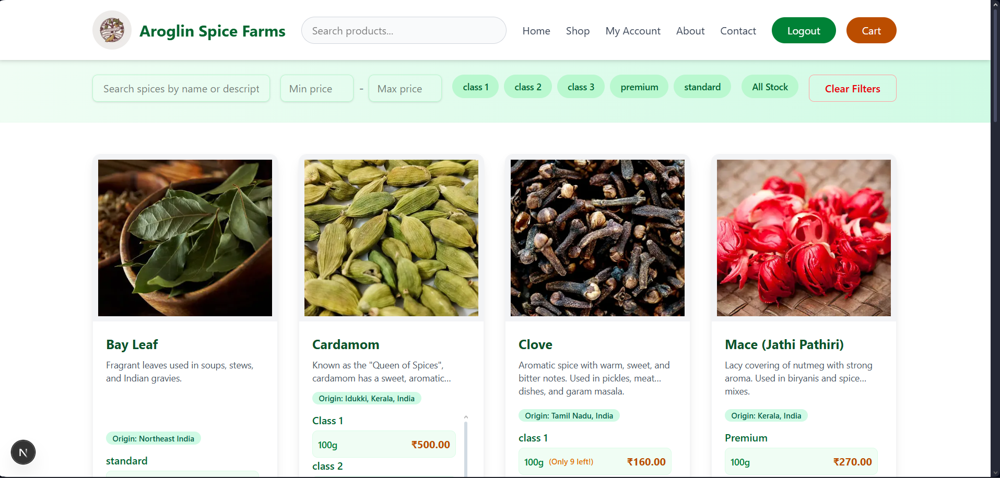
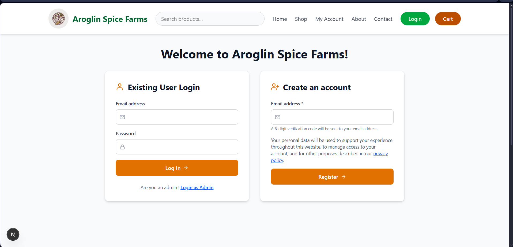
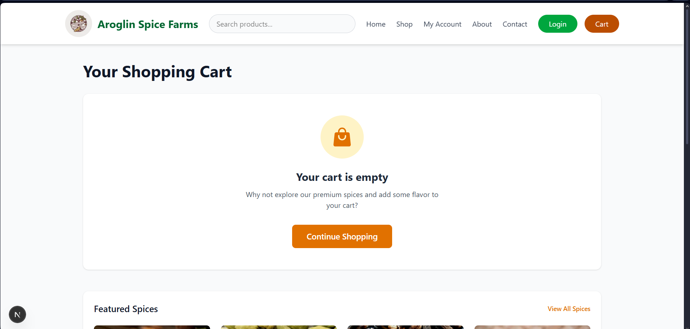
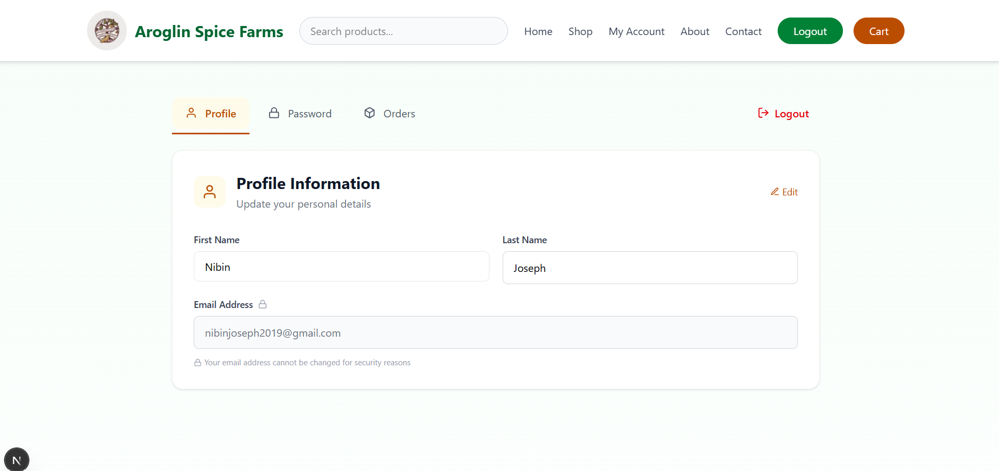
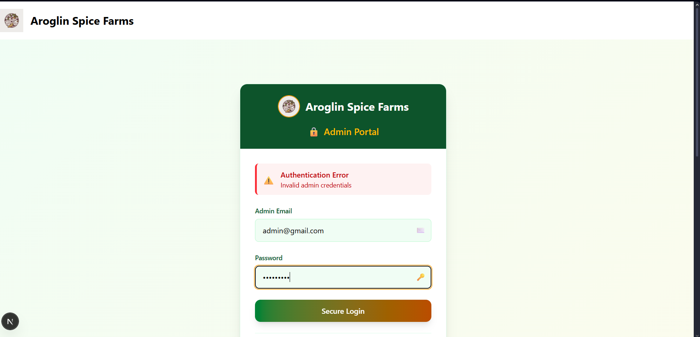
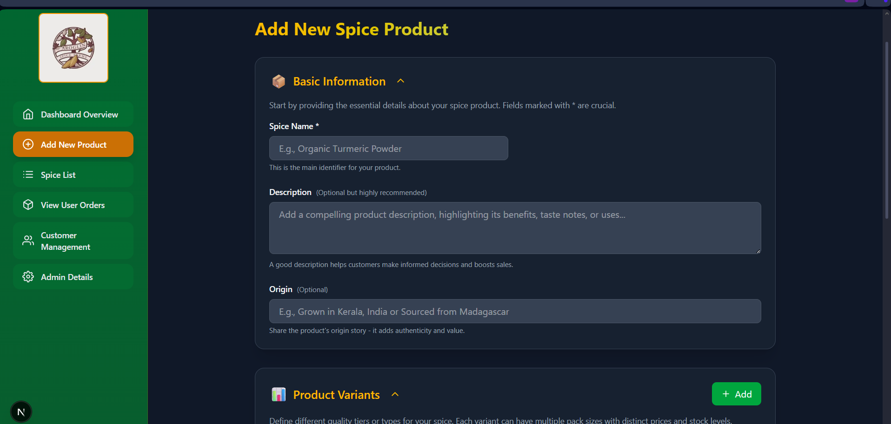
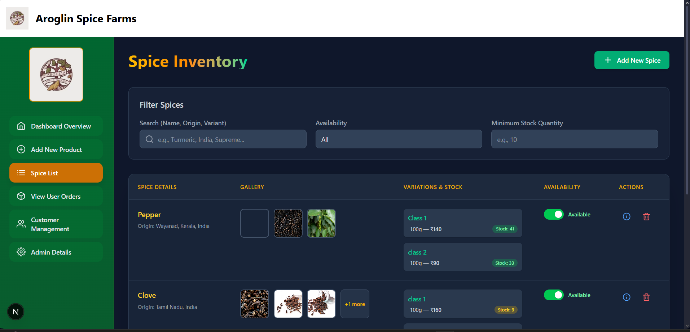
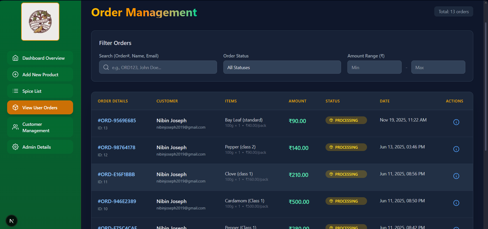
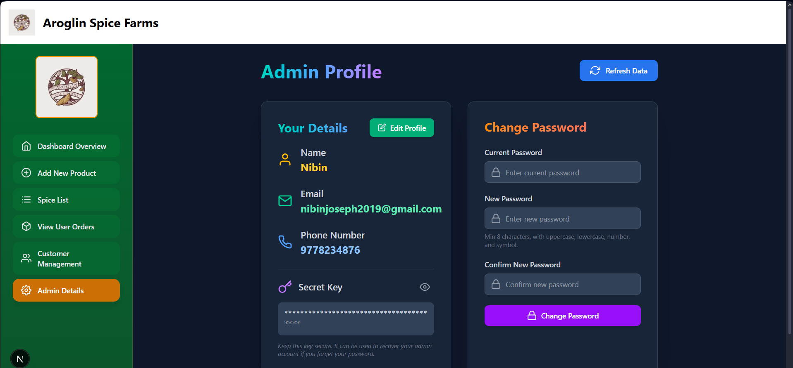

# Aroglin Spice Farms - E-Commerce Platform

A full-stack e-commerce application for a local spice shop, built with **Spring Boot** (Backend) and **Next.js** (Frontend). Customers can browse, search, and purchase premium spices online, while admins manage inventory, orders, and customer relationships.

---

## Table of Contents

- [Features](#-features)
- [Tech Stack](#-tech-stack)
- [Authentication Methods](#-authentication-methods)
- [Prerequisites](#-prerequisites)
- [Setup Instructions](#-setup-instructions)
- [Environment Variables](#-environment-variables)
- [Database Configuration](#-database-configuration)
- [API Endpoints](#-api-endpoints)
- [Project Structure](#-project-structure)
- [Running the Application](#-running-the-application)
- [Additional Notes](#-additional-notes)

---

## Features

### Customer Features

- **User Authentication**
  - Email-based registration with OTP verification
  - Secure login with session management
  - Password change functionality
  - Session persistence

- **Product Browsing**
  - Browse all available spices
  - Search and filter products by:
    - Name/Description
    - Price range
    - Origin (e.g., Kerala)
    - Quality class (e.g., Organic, Premium)
    - Stock availability
  - View detailed product information
  - Related products suggestions
  - Pagination support

- **Shopping Cart**
  - Add products to cart
  - Update quantities
  - Remove items
  - Real-time cart count
  - Persistent cart per user

- **Order Management**
  - Place orders with delivery address
  - Order history tracking
  - Order status tracking (Pending, Processing, Shipped, Delivered, Cancelled, Refunded)
  - Detailed order view with invoice
  - Order notes support

- **Payment Integration**
  - Razorpay payment gateway integration
  - Payment verification
  - Multiple payment methods (Razorpay, COD)
  - Payment status tracking

- **User Profile**
  - View and edit profile information
  - Change password
  - View order history
  - Order details with tracking

### Admin Features

- **Admin Authentication**
  - Secure admin login
  - Session-based authentication
  - Password recovery with secret key
  - Password change functionality

- **Spice Management**
  - Add new spices with:
    - Name, description, origin
    - Multiple variants (quality classes)
    - Multiple pack sizes with prices
    - Stock quantities
    - Multiple product images
  - Edit existing spices
  - Delete spices
  - Update availability status
  - View all spices with details

- **Order Management**
  - View all customer orders
  - View detailed order information
  - Update order status
  - Track payment status
  - Order filtering and search

- **Customer Management**
  - View all registered customers
  - Customer details and information

- **Admin Profile**
  - View admin profile
  - Edit profile information
  - Change password

---

## Screenshots

### Customer Experience










### Admin Experience












---

## Tech Stack

### Backend
- **Framework**: Spring Boot 3.4.5
- **Language**: Java 21
- **Database**: PostgreSQL
- **ORM**: Spring Data JPA / Hibernate
- **Security**: Spring Security (BCrypt password encoding)
- **Session Management**: Spring Session JDBC
- **Payment Gateway**: Razorpay Java SDK
- **Email Service**: Spring Mail (SMTP)
- **PDF Generation**: iText PDF
- **Build Tool**: Maven
- **Other Libraries**:
  - Lombok
  - Apache Commons Codec
  - JSON Library

### Frontend
- **Framework**: Next.js 15.3.1
- **Language**: JavaScript (React 19)
- **Styling**: Tailwind CSS 4
- **Animations**: Framer Motion
- **Icons**: Heroicons, React Icons
- **Charts**: Chart.js, React Chart.js 2
- **Notifications**: React Toastify
- **HTTP Client**: Fetch API

---

## Authentication Methods

### Customer Authentication

1. **Registration Flow**:
   - User enters email address
   - System sends 6-digit OTP to email
   - User verifies OTP
   - User completes registration with:
     - First Name
     - Last Name
     - Password (with strength validation)
   - Password requirements:
     - Minimum 8 characters
     - At least one uppercase letter
     - At least one lowercase letter
     - At least one number
     - At least one special character

2. **Login Method**:
   - Email and password authentication
   - Session-based authentication (HttpSession)
   - Session stored in PostgreSQL database
   - Session timeout: 60 minutes
   - Automatic session validation

3. **Password Management**:
   - Change password (requires current password)
   - Password strength validation
   - BCrypt hashing for security

### Admin Authentication

1. **Login Method**:
   - Email and password authentication
   - Session-based authentication
   - Admin session stored separately

2. **Password Recovery**:
   - Email verification
   - Secret key verification
   - Password reset with new password
   - Password complexity validation

3. **Security Features**:
   - BCrypt password hashing
   - Secret key for password recovery
   - Session management

---

## Prerequisites

Before you begin, ensure you have the following installed:

- **Java Development Kit (JDK)**: Version 21 or higher
- **Node.js**: Version 18 or higher
- **npm** or **yarn**: Package manager for Node.js
- **PostgreSQL**: Version 12 or higher
- **Maven**: Version 3.6 or higher (usually comes with Spring Boot)
- **Git**: For version control

---

## Setup Instructions

### Backend Setup (Spring Boot)

1. **Clone the repository** (if not already done):
   ```bash
   git clone <repository-url>
   cd spice-shop/spring-backend
   ```

2. **Database Setup**:
   - Create a PostgreSQL database named `spice-shop`
   - Update database credentials in `application.properties` (see Database Configuration section)

3. **Environment Variables**:
   - Create a `.env.properties` file in the `spring-backend` directory
   - Add the required environment variables (see Environment Variables section)

4. **Build the project**:
   ```bash
   mvn clean install
   ```

5. **Run the application**:
   ```bash
   mvn spring-boot:run
   ```
   Or use the Maven wrapper:
   ```bash
   ./mvnw spring-boot:run
   ```
   On Windows:
   ```bash
   mvnw.cmd spring-boot:run
   ```

   The backend will start on `http://localhost:8080` (default port)

6. **Create uploads directory**:
   ```bash
   mkdir uploads/spices
   ```
   This directory is used for storing uploaded spice images.

### Frontend Setup (Next.js)

1. **Navigate to frontend directory**:
   ```bash
   cd ../next-frontend
   ```

2. **Install dependencies**:
   ```bash
   npm install
   ```
   Or using yarn:
   ```bash
   yarn install
   ```

3. **Environment Variables**:
   - Create a `.env.local` file in the `next-frontend` directory
   - Add the following:
     ```env
     NEXT_PUBLIC_BACKEND_URL=http://localhost:8080
     ```

4. **Run the development server**:
   ```bash
   npm run dev
   ```
   Or using yarn:
   ```bash
   yarn dev
   ```

   The frontend will start on `http://localhost:3000`

5. **Build for production** (optional):
   ```bash
   npm run build
   npm start
   ```

---

## Environment Variables

### Backend (.env.properties)

Create a `.env.properties` file in the `spring-backend` directory:

```properties
# Frontend URL (for CORS)
FRONTEND_URL=http://localhost:3000

# Backend URL
BACKEND_URL=http://localhost:8080

# Email Configuration (Gmail SMTP)
EMAIL_USERNAME=your-email@gmail.com
EMAIL_PASSWORD=your-app-password

# Razorpay Configuration
RAZORPAY_KEY_ID=your-razorpay-key-id
RAZORPAY_KEY_SECRET=your-razorpay-key-secret
```

**Note**: For Gmail, you need to generate an "App Password" instead of using your regular password. Go to Google Account Settings > Security > 2-Step Verification > App Passwords.

### Frontend (.env.local)

Create a `.env.local` file in the `next-frontend` directory:

```env
NEXT_PUBLIC_BACKEND_URL=http://localhost:8080
```

---

## Database Configuration

### PostgreSQL Setup

1. **Install PostgreSQL** (if not already installed)

2. **Create Database**:
   ```sql
   CREATE DATABASE "spice-shop";
   ```

3. **Update `application.properties`**:
   ```properties
   spring.datasource.url=jdbc:postgresql://localhost:5432/spice-shop
   spring.datasource.username=postgres
   spring.datasource.password=your-password
   ```

4. **Database Schema**:
   - The application uses JPA/Hibernate with `spring.jpa.hibernate.ddl-auto=update`
   - Tables will be automatically created/updated on application startup
   - Spring Session tables will also be created automatically

### Database Tables

The application creates the following tables automatically:
- `users` - Customer information
- `admins` - Admin accounts
- `spices` - Spice products
- `spice_variants` - Spice quality variants
- `spice_packs` - Pack sizes and prices
- `spice_images` - Product images
- `carts` - Shopping carts
- `cart_items` - Cart items
- `orders` - Customer orders
- `order_items` - Order line items
- `payments` - Payment records
- `delivery_addresses` - Shipping addresses
- `spring_session` - Session management
- `spring_session_attributes` - Session attributes

---

## API Endpoints

### Authentication Endpoints

#### Customer Authentication
- `POST /api/auth/send-otp` - Send OTP for registration
- `POST /api/auth/verify-otp` - Verify OTP
- `POST /api/auth/register` - Complete user registration
- `POST /api/auth/login` - User login
- `POST /api/auth/logout` - User logout
- `GET /api/auth/check-session` - Check user session
- `POST /api/auth/change-password` - Change user password

#### Admin Authentication
- `POST /api/admin/login` - Admin login
- `POST /api/admin/logout` - Admin logout
- `GET /api/admin/profile` - Get admin profile
- `PUT /api/admin/update-profile/{id}` - Update admin profile
- `POST /api/admin/change-password` - Change admin password
- `POST /api/admin/forgot-password/check-email` - Check admin email
- `POST /api/admin/forgot-password/verify-key` - Verify secret key
- `POST /api/admin/forgot-password/reset` - Reset password

### Product Endpoints

- `GET /api/spices` - Get all spices
- `GET /api/spices/{id}` - Get spice by ID
- `POST /api/spices` - Create new spice (Admin)
- `PUT /api/spices/{id}` - Update spice (Admin)
- `DELETE /api/spices/{id}` - Delete spice (Admin)
- `PATCH /api/spices/{id}/availability` - Update availability (Admin)
- `GET /api/products` - Get products with filters and pagination
- `GET /api/spices/{id}/related` - Get related spices
- `GET /api/quality-classes` - Get unique quality classes

### Cart Endpoints

- `GET /api/cart` - Get user cart
- `POST /api/cart/items` - Add item to cart
- `PUT /api/cart/items/{itemId}` - Update cart item
- `DELETE /api/cart/items/{itemId}` - Remove cart item
- `GET /api/cart/count` - Get cart item count

### Order Endpoints

- `POST /api/orders/place` - Place new order
- `GET /api/orders/history` - Get user order history
- `GET /api/orders/{orderId}` - Get order details (User)
- `GET /api/orders/all` - Get all orders (Admin)
- `GET /api/orders/admin/{orderId}` - Get order details (Admin)
- `PATCH /api/orders/admin/{orderId}/status` - Update order status (Admin)

### Payment Endpoints

- `POST /api/payments/verify` - Verify Razorpay payment

### User Endpoints

- `GET /api/users/profile` - Get user profile
- `PUT /api/users/profile` - Update user profile

---

## Project Structure

```
spice-shop/
├── spring-backend/
│   ├── src/
│   │   ├── main/
│   │   │   ├── java/com/spiceshop/
│   │   │   │   ├── config/          # Configuration classes
│   │   │   │   ├── controllers/     # REST controllers
│   │   │   │   ├── dto/             # Data Transfer Objects
│   │   │   │   ├── exceptions/      # Custom exceptions
│   │   │   │   ├── models/          # Entity models
│   │   │   │   ├── repositorys/     # JPA repositories
│   │   │   │   ├── services/        # Business logic
│   │   │   │   └── SpiceShopApplication.java
│   │   │   └── resources/
│   │   │       ├── application.properties
│   │   │       └── templates/       # Email templates
│   │   └── test/                    # Test files
│   ├── uploads/                     # Uploaded files
│   ├── pom.xml                      # Maven configuration
│   └── .env.properties              # Environment variables
│
└── next-frontend/
    ├── src/
    │   ├── app/                     # Next.js app directory
    │   │   ├── admin/               # Admin pages
    │   │   ├── admin-dashboard/     # Admin dashboard
    │   │   ├── admin-login/         # Admin login
    │   │   ├── cart/                # Shopping cart
    │   │   ├── checkout/            # Checkout process
    │   │   ├── my-account/          # User login/register
    │   │   ├── my-profile/          # User profile
    │   │   ├── products/            # Product details
    │   │   ├── shop/                # Shop page
    │   │   ├── layout.js            # Root layout
    │   │   └── page.js              # Home page
    │   └── components/              # React components
    │       ├── admin/               # Admin components
    │       ├── auth/                # Authentication components
    │       ├── home/                # Home page components
    │       ├── profile/             # Profile components
    │       └── spice-detail/        # Product detail components
    ├── public/                      # Static assets
    ├── package.json                 # Node.js dependencies
    └── .env.local                   # Environment variables
```

---

## Running the Application

### Development Mode

1. **Start PostgreSQL** (ensure it's running)

2. **Start Backend**:
   ```bash
   cd spring-backend
   mvn spring-boot:run
   ```
   Backend runs on: `http://localhost:8080`

3. **Start Frontend** (in a new terminal):
   ```bash
   cd next-frontend
   npm run dev
   ```
   Frontend runs on: `http://localhost:3000`

4. **Access the Application**:
   - Customer Portal: `http://localhost:3000`
   - Admin Portal: `http://localhost:3000/admin-login`

### Production Build

**Backend**:
```bash
cd spring-backend
mvn clean package
java -jar target/spice-shop-0.0.1-SNAPSHOT.jar
```

**Frontend**:
```bash
cd next-frontend
npm run build
npm start
```

---

## Additional Notes

### Session Management

- The application uses **Spring Session JDBC** for session management
- Sessions are stored in PostgreSQL database
- Session timeout is set to 60 minutes
- Sessions are automatically cleaned up by Spring Session

### File Uploads

- Spice images are uploaded to `uploads/spices/` directory
- Maximum file size: 10MB per file
- Supported formats: Images (configured in frontend)

### Email Service

- Uses Gmail SMTP for sending emails
- Sends:
  - Registration OTP
  - Welcome emails
  - Order confirmation emails
  - Order status update emails

### Payment Gateway

- Integrated with **Razorpay**
- Supports online payments
- Payment verification implemented
- Order status updates based on payment status

### Security Features

- BCrypt password hashing
- Session-based authentication
- CORS configuration
- SQL injection protection (JPA)
- XSS protection (React/Next.js)

### Admin Account Creation

To create an admin account, use the admin creation endpoint:
```bash
POST /api/admin/create
```

Or create directly in the database with a hashed password.

### Default Configuration

- Backend Port: `8080`
- Frontend Port: `3000`
- Database Port: `5432` (PostgreSQL default)
- Session Timeout: `60 minutes`

---

## Contributing

1. Fork the repository
2. Create a feature branch
3. Commit your changes
4. Push to the branch
5. Create a Pull Request

---

## License

This project is licensed under the MIT License.

---

## Author

**Aroglin Spice Farms**

---

## Support

For support, email nibin.joseph.career@gmail.com.

---

**Happy Coding!**

